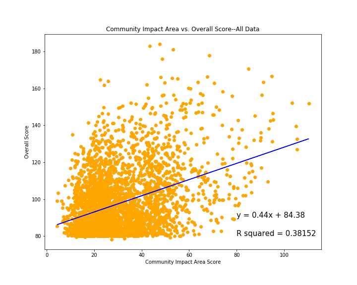
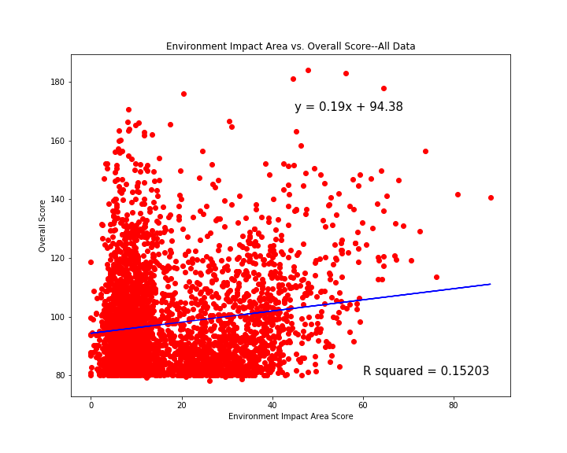
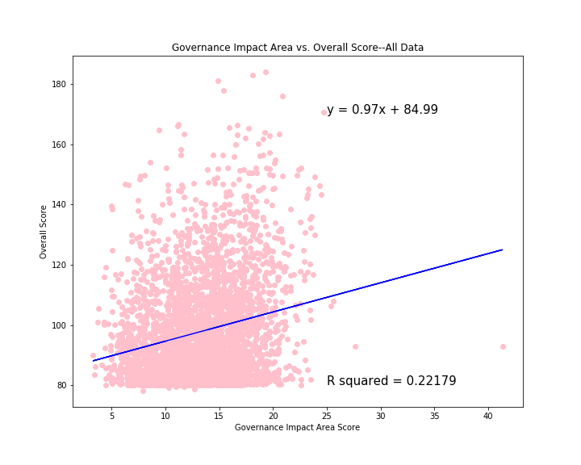
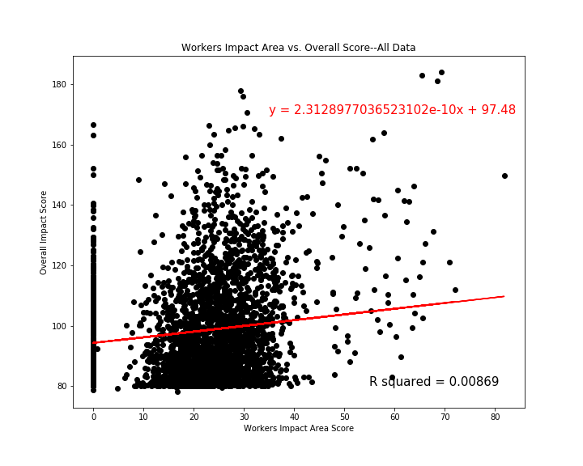
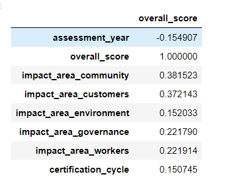

# B Corps Analysis

# **Summary of Interests and Intent**

B Corporations are a new frontier in corporate social responsibility (CSR). Interested corporations must undergo a rigorous certification process to prove their dedication to the mission of B Corporations, which is to “work toward reduced inequality, lower levels of poverty, a healthier environment, stronger communities, and the creation of more high quality jobs with dignity and purpose. By harnessing the power of business, B Corps use profits and growth as a means to a greater end: positive impact for their employees, communities, and the environment.” (https://bcorporation.net/about-b-corps) The certification process includes an “Impact Assessment” which is organized into five Impact Areas: Governance, Workers, Community, Environment, and Customers. The companies are being scored on a very specific set of metrics that B Certification deemed the most important measures of the applying companies’ impact. During each certification cycle the companies are again scored on the aforementioned metrics; this will be important in isolating trends in how companies’ strategy aligns with B Certification’s mission statement. 

# **Questions Asked**
#### **Community Impact Area**: 
From the B-analytics standards navigator: The community impact area “evaluates the company’s positive impact on the eternal communities in which the company operates.” This includes things like diversity measures, economic impact, civic engagement, and supply chain impact. A scatterplot mapping the community impact area scores of all US B Corps in our dataset vs. the overall impact scores shows that variation in overall impact scores can be explained about 38% of the time by variation in community impact scores. In layman’s terms, the community impact area is responsible for about 38% of the overall score. 

#### **Environment Impact Area**:
From the B-analytics standards navigator: The environment impact area measures overall environmental stewardship of the company, asking questions in areas such as how the company identifies and manages general environmental impacts, specifically with things like air and climate issues, water sustainability, and impacts on land and life. A scatterplot mapping the environment impact area score vs the overall impact score shows that variation in overall impact scores can be explained about 15% of the time by variation in environment impact scores. In layman’s terms, the environment impact area is responsible for about 15% of the overall score.

#### **Customers Impact Area**: 
From the B-analytics standards navigator: The customers impact area evaluates the company’s value to their direct customers and consumers of their products and services, and asks questions like whether the company specifically benefits underserved populations, addresses social and/or economic problems, or helps create access to basic services. A scatterplot mapping the customers impact area score vs. the overall impact score shows that variation in overall impact score can be explained by variation in the customers impact score about 0.8% of the time. There’s not much of a linear relationship to be found here--which may speak partly to the relative importance of the customers impact area in assigning overall scores (low), or the fact that the dataset itself had many more NaNs that required filtering out than the other impact areas, which may have affected the regression.

#### **Governance Impact Area**: 
From the B-analytics standards navigator--the governance impact area evaluates the overall mission, ethics, accountability, and transparency of the company itself, asking questions that are largely centered around whether the company incorporates internal review of social and environmental performance principles, among other measures. A scatterplot mapping the governance impact area score vs the overall impact score shows that variation in overall impact scores can be explained by variation in the governance impact score about 22% of the time. In layman’s terms, the governance impact area is responsible for about 22% of the overall impact score. 

#### **Workers Impact Area**: 
From the B-analytics standards navigator: The Workers Impact Area evaluates a company’s contribution to financial, physical, professional, and social well-being, and asks questions primarily centered around whether most employees are full time, part time, or temporary, and whether their compensation is fixed, hourly, or daily, and weather the company is committed to hiring underemployed populations. A scatterplot mapping the workers impact area score vs. the overall impact score shows only a loose relationship between the two. An r squared value of 0.008 suggests that the variation in the workers impact area score only explains about 0.8% of the variation in the overall impact score. However, the workers impact area (like the customers impact area) also had more missing data (and NaN values) then the other impact areas, so the looser/lack of relationship here may be explained by the missing data.

#### **Correlation Data**: 
Calculating simple correlation coefficients between each impact area and the overall impact score will offer a similar insight to the linear regression graphs, but will provide a clearer insight into the correlation between each impact area and the overall score. Like the regression data, the correlation data tells us that the community impact area has the greatest influence on the overall score (i.e., is the most highly correlated), and the correlation coefficients largely match the r squared values from the individual linear regressions. 

